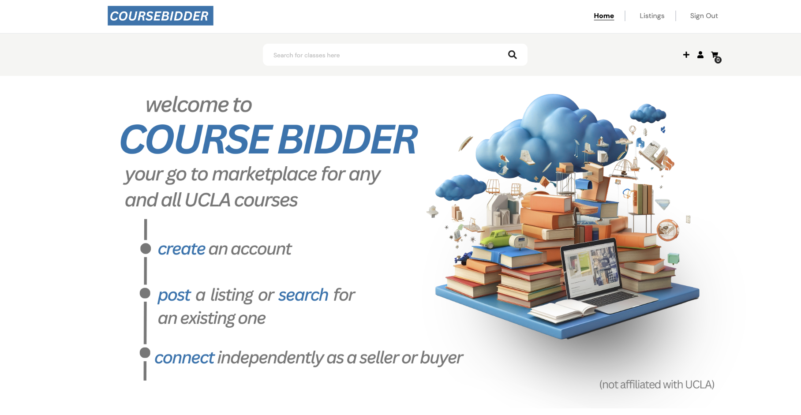
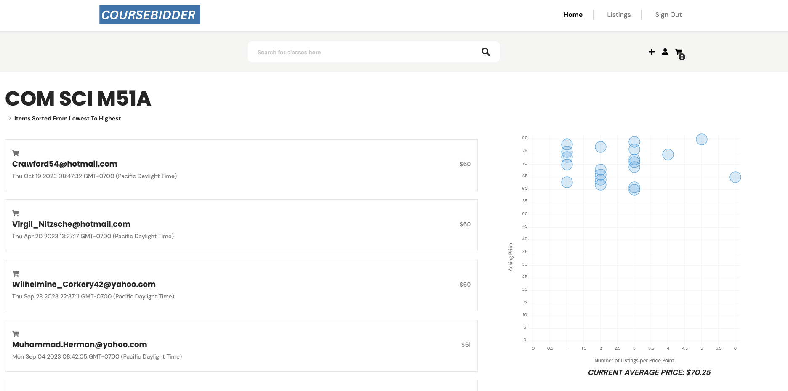

# Welcome to CourseBidder! 

[](https://facebook.github.io/react-native/)

As students struggle to enroll in high demand courses at UCLA, a resale market has emerged where individuals buy and sell seats in classes. Morality aside, the market exists and lives unorganized and sometimes inaccessible across various social media platforms. CourseBidder seeks to provide a consolidated landing space for UCLA students to buy and sell their courses, connect buyers to sellers. The site provides statistics and extra functionality regarding the market, with hopes to make the transaction process more streamlined for all parties involved.

Originally developed for UCLA's CS35L course. Current version exists as a minimum viable product.

Contributors: Anish Pal, Ved Joshi, Kareem Dibs, Vikram Ramesh, Atij Mahesh




## Table of Contents

- [Prerequisites](#prerequisites)
- [Installation](#installation)
- [Running](#running)
- [Features](#features)
- [Issues](#issues)

## Preqrequisites 

- Node.js (>= v18.0.0). Install Node [here](https://nodejs.org/en/download).
- npm (>= v8.3.0)

## Getting Started

### Installation

1. Clone the repository and enter it:

    Using HTTPS:

   ```shell
   git clone https://github.com/vedjoshi1/CourseBidder.git
   cd ./CourseBidder
    ```

    Using SSH: 
    ```shell
   git clone git@github.com:vedjoshi1/CourseBidder.git
   cd ./CourseBidder
    ```


2. Install dependencies by running ``npm install``

### Setup MongoDB

Currently running on an Atlas cluster launched concurrently with ''npm run start''

To configure the project with your personalized MongoDB Atlas database follow these instructions.

If you do not have a prexisting MongoDB Atlas Account, create one for free [here](https://www.mongodb.com/cloud/atlas/register?psafe_param=1&utm_content=rlsapostreg&utm_source=google&utm_campaign=search_gs_pl_evergreen_atlas_general_retarget-brand-postreg_gic-null_amers-us-ca_ps-all_desktop_eng_lead&utm_term=&utm_medium=cpc_paid_search&utm_ad=&utm_ad_campaign_id=14383025495&adgroup=129270225274&cq_cmp=14383025495&gad=1&gclid=CjwKCAjwsvujBhAXEiwA_UXnAA71bmfDMgORfSGo3clw4b96pzA9ZFuofWJjCbIJhJtGAmcWKlnG5xoCehgQAvD_BwE).

Once logged in, navigate to Dashboard. Under the Deployment header, click ``Database``.

Click Green Button with message ``Build a Database``.

Choose which deployment option you would like to use. Shared Clusters are free.

Choose your favorite Cloud Provider and Region. Recommended to stick with the default (AWS).

Press Green Button with message ``Create Cluster``.

While waiting for Cluster Provisioning, navigate to `Security` header and select `Database Access`. Click `Add New Database User`. Fill out form.

Under `Security` header, select `Network Access` Tab. Press `Add IP Address`.

Select either `Add Current IP Address` or `Allow Access From Anywhere`. Press confirm.

Wait for Cluster Provisioning to finish.

Once finished, press `Connect`. Under `Connect to your application`, select `Drivers`.

Follow driver installation instructions. Copy your connection string.
Should be in the format:
``mongodb+srv://<username>:<password>@cluster0.qan00x8.mongodb.net/?retryWrites=true&w=majority``.

**Remember to replace &lt;username&gt; and &lt;password&gt; with your login credentials.**

Within CourseBidder repository, navigate to `ServerStuff.js` and change the connection string to your generated string. 

### Running

Run ``npm start`` for a development build of the project running locally. Frontend website runs on ``localhost:3000`` and backend server functionality runs on ``localhost:30001``

## Features

- **Search UCLA Class Database** Use an intelligent autocomplete search to comb through hundreds of courses to find listings. 
- **Post and Buy Listings:** Set a variable price for your class listing as a seller. As a seller, see tens of listings sorted by price. 
- **Class Analytics** See all listings through a beautiful scatter plot displaying frequency versus price of listing. Explore other relevant data such as average class selling price, median selling price, and rate at which classes are sold. 
- **Authenticated Login:** Authenticate users for secure access to the app, as well as preventing dummy listing postings. Uses SHA-256 hash for password protection.

## Issues

For any issues please contact one of the developers:

[Anish Pal](anishmpal@gmail.com)
